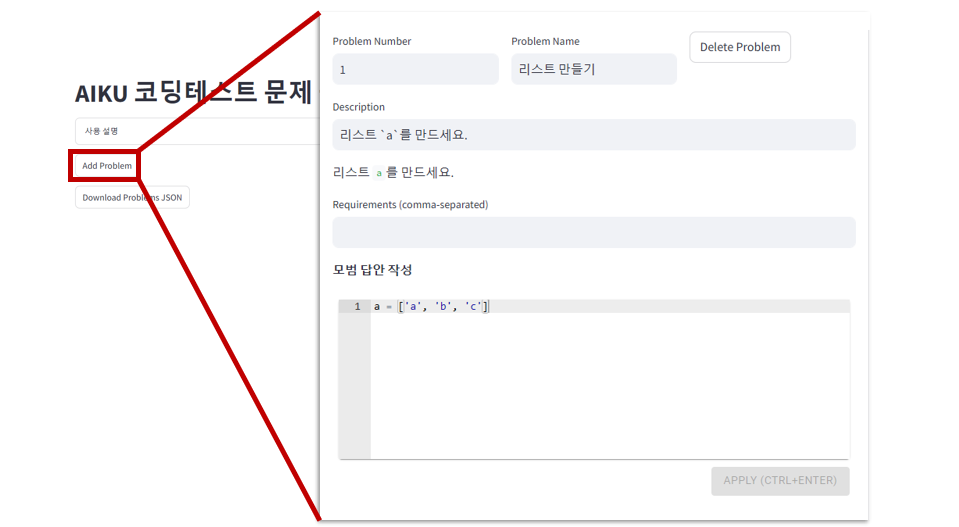
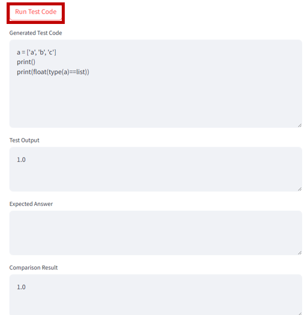

# AIKU 코딩 테스트 문제 출제 도우미
고려대학교 정보대학 AIKU의 리크루팅 사전 테스트 (코딩 테스트) 문제 출제 및 채점 자동화를 위한 자동 채점기 및 문제 출제 플랫폼입니다.

## 문제 출제

---
**Streamlit**을 통해 구현하였으며, [여기에서 사용 가능합니다.](https://jeonseonghu-aiku-codingtest-autograder-app-6hlyak.streamlit.app/)

### 주요 기능:

---
- **문제 추가**: 문제 틀을 쉽게 추가하여 문제 은행을 만들 수 있습니다.
- **문제 상세 설정**: 문제 번호, 제목, 설명, 요구사항(필요 패키지), 모범 답안 코드, 채점 코드, 테스트 케이스를 상세히 설정할 수 있습니다.
- **테스트 코드 실행**: 실시간으로 작성한 코드를 테스트하고 결과를 확인할 수 있습니다.
- **Colab 노트북 생성**: 문제 설명과 모범 답안이 담긴 Colab 노트북 파일을 자동으로 생성합니다.
- **JSON 파일 저장**: 문제 정보와 채점 기준을 JSON 형태로 저장하여 관리를 용이하게 합니다.

### 사용 방법

---
#### 문제 추가하기

"Add Problem"을 클릭하면, 새로운 문제가 생성됩니다.
- **Problem Number**: 문제 번호입니다. 노트북 생성시 "Q. 1."과 같이 사용되며, 아래의 "부분 문제" 필드에도 사용됩니다.
- **Problem Name**: 문제 제목입니다.
- **Description**: 문제 설명으로, Colab 노트북 생성 시에만 해당 파일에 저장됩니다.
- **Requirements(Optional)**: 채점 시에 필요한 파이썬 라이브러리 목록입니다. 라이브러리의 이름만 적어주시면 되며, pandas는 "pandas as pd", numpy는 "numpy as np"로 자동 변환됩니다.
- **모범 답안 작성**: 해당 문제의 모범 답안으로, 아래 Test Code가 잘 실행되는 지 확인하기 위해 필요합니다. 해당 코드가 Colab 노트북 파일에 저장됩니다.
- **태스트 코드 작성**: 문제를 채점하기 위한 테스트 코드를 작성합니다. 아래의 유의사항을 확인하여 작성해주시기 바랍니다.
  1. 테스트 케이스 input은 `<input> `으로 표시합니다. 해당 부분은 코드 실행 시 자동으로 변환됩니다.
  2. 해당 코드의 마지막 출력 (`print`) 줄이 `output`으로 간주되어 아래의 `Expected answer`과 비교됩니다.
  3. `output`은 자동으로 아래에서 설정할 `Expected answer type`으로 변환됩니다.
- **Number of Test cases**: Test case의 개수를 지정합니다.
- **Test Case Input / Expected Answer**: 각 Test case에 대한 Input과 예상 답안을 작성합니다.
- **Expected Answer Type**: Expected Answer의 Type을 결정합니다.
  - **point**: `output`을 float로 변환하여 그대로 해당 문제의 점수로 사용합니다. 좀 더 복잡한 test code를 작성하고자 할 때 유용합니다.
  - **float**: `output`과 `Expected Answer`를 모두 float로 변환하여, 두 값의 차가 `1e-6`이하이면 정답으로 간주합니다.
  - **그 외**: `eval()`을 사용하여, 각각에 맞는 자료형으로 변환한 뒤 항등연산자(`==`)로 비교합니다.
- **부분 문제**: 해당 문제를 풀기 전에 먼저 풀어야 하는 모든 문제의 번호를 써주시면 됩니다. 각 번호에 해당하는 모든 문제의 답안(코드)이 자동으로 포함되어 채점됩니다.

---
#### 테스트 코드 실행하기

- 문제를 모두 완성한 후, `Run Test Code` 버튼을 눌러 코드를 실행해볼 수 있습니다. **첫번째 Test case에 대해서만 실행되며, 추후 모든 테스트 케이스를 실행해 볼 수 있도록 수정할 계획입니다.**
- **Generated Test Code**: Test case input, import, 부분 문제 등이 반영된 실제 실행된 코드입니다.
- **Test Output**: 해당 코드 출력 결과의 **마지막 줄**입니다.
- **Expected Answer**: Test case에 해당하는 Expected Answer입니다.
- **Comparison Result**: 채점 결과입니다. 0.0(오답) 혹은 1.0(정답)을 반환하며. Expected Answer Type을 Point로 설정한 경우 `output`을 그대로 출력합니다.

#### 파일 저장 및 불러오기
저장할 수 있는 파일의 목록은 다음과 같습니다.
- Problems JSON
- Grading Criteria JSON
- Colab Notebook ipynb

JSON 파일들은 진행 상황을 저장하고 불러오는데에 사용되며, 특히 **Grading Criteria JSON은 후술될 채점 과정에서 반드시 필요합니다.**

Colab Notebook ipynb 파일은 수정 및 내용 추가가 자유롭게 가능하나, 다음 사항을 명심해주세요.
- **문제의 순서가 바뀌면 안됩니다.**
- 채점 시, **Q.** 이 존재하는 마크다운을 기준으로 문제를 식별합니다.
- **Q.** 가 존재하는 마크다운 바로 **아래 칸 코드**를 해당 문제에 대한 정답으로 간주하여 채점합니다. 평가자가 임의로 셀 추가를 하거나, 마크다운을 삭제하지 않도록 지도해주세요.

## 문제 채점

---
위에서 제작한 **Grading Criteria JSON**과 평가자들의 **Colab Notebook ipynb**을 가지고, 모든 문제를 한꺼번에 채점할 수 있습니다.

평가자들의 답안은 `answers/`에, Grading Criteria JSON 파일 실행 경로에 넣어주세요.
```
aiku-codingtest-autograder
├── answers/
│   ├── evaluator1.ipynb
│   ├── evaluator2.ipynb
│   └── ...
├── main.py
└── grading_criteria.json
```
아래과 같이 실행할 수 있으며, 결과는 `results` 폴더에 저장됩니다.
```
git clone https://github.com/JeonSeongHu/aiku-codingtest-autograder.git
pip install -p requirement.txt
python main.py
```